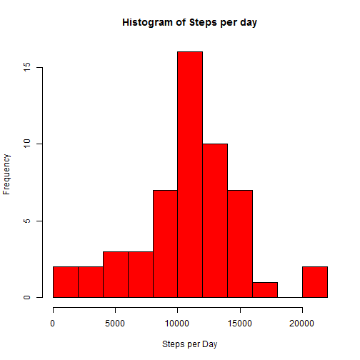
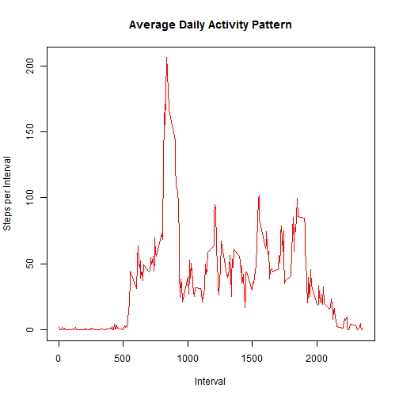
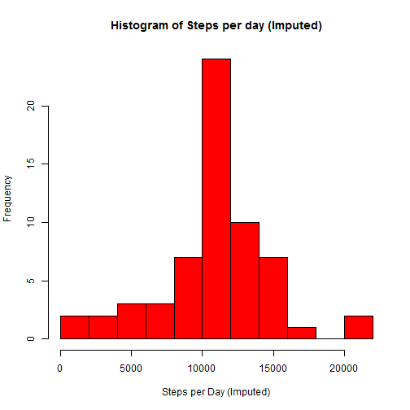
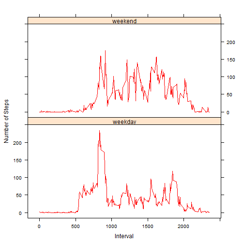

# Reproducible Research: Peer assessment 1
### Github repository: https://github.com/css281/RepData_PeerAssessment1
=========================================================================

## Prepare the R environment

Load required libraries. Set options for code chunks in this document, **echo = TRUE** so that R code is printed out.


```r
library(lattice)
opts_chunk$set(echo = TRUE)
```


## Loading and preprocessing the data

**Note**: It is assumed that the file activity.zip is in the current working directory. The data is extracted and read into a dataframe.


```r
zip <- paste(getwd(), "/activity.zip", sep = "")
if(file.exists(zip)){
	unzip(zip, list = FALSE, overwrite = FALSE)
}

activity_data <- read.csv('activity.csv', header = TRUE, sep = ",", 
                          colClasses=c("numeric", "Date", "numeric"))
```


## What is mean total number of steps taken per day?

### 1. and 2. Calculate the total number of steps taken per day. Make a histogram of the total number of steps taken each day

Utilize tapply to calculate total steps grouped by date and then plot the histogram of Steps per day.


```r
steps_per_day <- tapply(activity_data$steps, activity_data$date, FUN=sum)
hist(steps_per_day, breaks = 8, main = "Histogram of Steps per day", xlab="Steps per Day", ylab = "Frequency",
     border="black", col="red")
```

 

### 3. Calculate and report ***mean*** and ***median*** of the number of steps taken per day


```r
steps_mean <- mean(steps_per_day, na.rm=TRUE)
steps_median <- median(steps_per_day, na.rm=TRUE)
```

The mean is **10766.189** and median is **10765**.


## What is the average daily activity pattern?

### 1. Make a time series plot (i.e. type = "l") of the 5-minute interval (x-axis) and the average number of steps taken, averaged across all days (y-axis)

Activity data is grouped by interval and the mean is calculated after omitting NA values. We make the plot with the time series of the average number of steps versus the 5-minute intervals -


```r
steps_per_interval <- tapply(activity_data$steps, activity_data$interval, function(x) mean(x, na.rm = TRUE))
intervals <- unique(activity_data$interval)
plot(intervals, steps_per_interval, type = 'l', col="red", main = "Average Daily Activity Pattern", 
     xlab = "Interval", ylab = "Steps per Interval")
```

 

### 2. Which 5-minute interval, on average across all the days in the dataset, contains the maximum number of steps?


```r
max_step_interval <- activity_data[which.max(steps_per_interval),]$interval
```

The **835<sup>th</sup>** interval has the maximum steps.


## Imputing missing values:

### 1. Calculate and report the total number of missing values in the dataset
Total number of missing values in the data set can be calculated using complete.cases() function. We also check the summary to show that steps is the column with missing values.


```r
summary(activity_data)
```

```
##      steps             date               interval     
##  Min.   :  0.00   Min.   :2012-10-01   Min.   :   0.0  
##  1st Qu.:  0.00   1st Qu.:2012-10-16   1st Qu.: 588.8  
##  Median :  0.00   Median :2012-10-31   Median :1177.5  
##  Mean   : 37.38   Mean   :2012-10-31   Mean   :1177.5  
##  3rd Qu.: 12.00   3rd Qu.:2012-11-15   3rd Qu.:1766.2  
##  Max.   :806.00   Max.   :2012-11-30   Max.   :2355.0  
##  NA's   :2304
```

```r
total_missing_values <- sum(!complete.cases(activity_data))
```

The total number of ***missing values*** is **2304**.


### 2. Strategy for filling in all of the missing values in the dataset

Notice that NAs only occur in the steps column. The strategy is to create a new completed dataset by replacing the missing step values with the mean value at the same interval across days. While the median would have been a better centrality measure than mean, in this case the total median is pretty close to the total mean, so replacing with mean is not a bad choice. We use an `ifelse` function to perform this replacement and `ifelse` recycles the mean vector so it will cycler over the days.

### 3. Create a new dataset that is equal to the original dataset but with the missing data filled in.


```r
imputed_activity <- data.frame(activity_data)
imputed_activity$steps <- ifelse(is.na(activity_data$steps), steps_per_interval, activity_data$steps)
```

Verify there are no missing values now


```r
sum(is.na(imputed_activity$steps))
```

```
## [1] 0
```

Zero output confirms there are no missing values.

### 4. Make a histogram of the total number of steps taken each day

Let us now plot a histogram of the total steps per day with the missing values filled.


```r
imputed_steps_per_day <- tapply(imputed_activity$steps, imputed_activity$date, FUN = sum)
hist(imputed_steps_per_day, breaks = 8, main = "Histogram of Steps per day (Imputed)", 
     xlab="Steps per Day (Imputed)", ylab = "Frequency", border="black", col="red")
```

 

We notice that the median is more pronounced as we filled-up the missing values contributing to more days with mean number of steps

### Calculate and report the **mean** and **median** total number of steps taken per day


```r
imputed_steps_mean <- mean(imputed_steps_per_day, na.rm=TRUE)
imputed_steps_median <- median(imputed_steps_per_day, na.rm=TRUE)
```

After missing values are filled, the mean is **10766.189** and the median is **10766.189**.

### Do these values differ from the estimates from the first part of the assignment? What is the impact of imputing missing data on the estimates of the total daily number of steps?

Yes, these values do differ slightly. While the mean is the same, the median value slightly increases converging towards the value of mean. While the peaks have changed between both the histograms, the overall trend remains similar before and after imputating missing data.


## Are there differences in activity patterns between weekdays and weekends?

Once the missing data is filled, we use the following logic to accomplish this 
1. Create an additional column in the activity data frame that tags each day as a weekday or weekend.
2. calculate the mean steps per interval by weekday and weekend
3. Plot the two data sets and compare activity patterns

### 1. Create a new factor variable in the dataset with two levels - "weekday" and "weekend" indicating whether a given date is a weekday or weekend day.


```r
activity_data$day_tag <- weekdays(as.Date(activity_data$date))
activity_data$day_tag <- ifelse(activity_data$day_tag == "Saturday" | activity_data$day_tag == "Sunday",
                                c("weekend"), c("weekday"))
activity_data$day_tag <- factor(activity_data$day_tag)
```

### 2. Make a panel plot containing a time series plot (i.e. type = "l") of the 5-minute interval (x-axis) and the average number of steps taken, averaged across all weekday days or weekend days (y-axis)


```r
mean_steps_by_day_tag <- aggregate(steps ~ interval + day_tag, data = activity_data, FUN = mean)
xyplot(steps ~ interval | day_tag, data = mean_steps_by_day_tag, layout = c(1, 2), type = "l", 
       xlab = "Interval", ylab = "Number of Steps", col = "red")
```

 

Based on the plot, the weekends see more peaks over 100 when compared to weekdays. It indicates that the workouts are consistently intense and longer over the weekends. On the other hand, we can see that the activity peaks during the weekday among all steps intervals (maybe a short intense workout during a workday).
